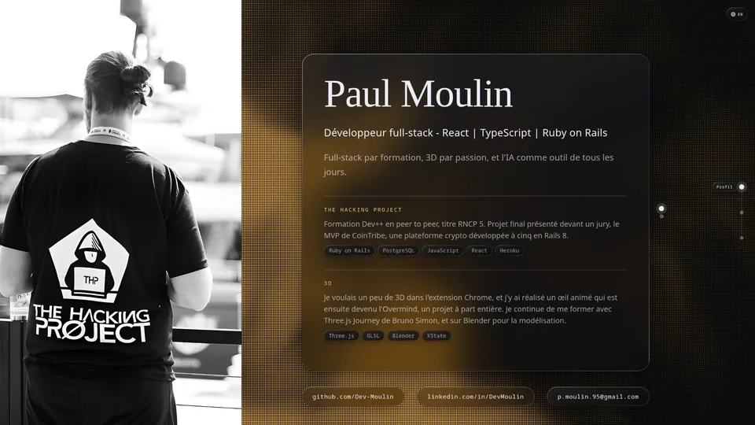

<h1 align="center">Paul Moulin</h1>
<h3 align="center">Développeur full-stack · Full-stack developer React | TypeScript | Ruby on Rails</h3>

  
  
  

  

  <a href="https://dev-moulin.github.io/Portfolio.2026/">→ Entrer dans le portfolio · Enter the portfolio (desktop & mobile)</a>

  <a href="#français">Français</a> · <a href="#english">English</a>

---

**Languages** &nbsp;      

**Frontend** &nbsp;&nbsp;&nbsp;     

**Backend** &nbsp;&nbsp;&nbsp;&nbsp;     

**Web3** &nbsp;&nbsp;&nbsp;&nbsp;&nbsp;&nbsp;&nbsp;&nbsp;   

**3D** &nbsp;&nbsp;&nbsp;&nbsp;&nbsp;&nbsp;&nbsp;&nbsp;&nbsp;&nbsp;&nbsp;&nbsp;  

**Tests** &nbsp;&nbsp;&nbsp;&nbsp;&nbsp;&nbsp;&nbsp;&nbsp;&nbsp;  

**Tools** &nbsp;&nbsp;&nbsp;&nbsp;&nbsp;&nbsp;&nbsp;&nbsp;&nbsp;     

---

## Français

Full-stack par formation, 3D par passion, et l'IA comme outil de tous les jours.

### Projets

| Projet | Description | Démo | Stack |
|--------|-------------|------|-------|
| [Portfolio.2026](https://github.com/Dev-Moulin/Portfolio.2026) | Mon portfolio actuel, en français et en anglais, sur ordinateur et téléphone | [Live](https://dev-moulin.github.io/Portfolio.2026/) | Angular 22, TypeScript, Three.js, Vitest |
| [MyPortfolio](https://github.com/Dev-Moulin/my-portfolio) | Mon portfolio précédent : un monde 3D spatial qu'on explore en temps réel | [Live](https://dev-moulin.github.io/my-portfolio/) | Three.js, XState, React 19, Vite |
| [Overmind Founders Collection](https://github.com/Dev-Moulin/Overmind_Founders_Collection) | Plateforme de vote NFT collaborative pour les 42 fondateurs d'INTUITION | [Live](https://dev-moulin.github.io/Overmind_Founders_Collection/) | TypeScript, React, Wagmi, INTUITION SDK |
| [Intuition Extension](https://github.com/intuition-box/Extension) | Extension Chrome Web3 pour la confiance décentralisée | [Releases](https://github.com/intuition-box/Extension/releases) | TypeScript, Plasmo, GraphQL, Tailwind |
| [Overmind 3D Controller](https://github.com/intuition-box/Overmind) | Visualisation et contrôle 3D temps réel avec machines à états | [Live](https://overmind.intuition.box/) | Three.js, XState v5, React 19, Vite |
| [Pulse](https://github.com/intuition-box/Pulse) | App de vote Web3 pour l'écosystème Ethereum via Worldcoin MiniKit | - | TypeScript, Worldcoin Minikit, INTUITION |
| [CoinTribe](https://github.com/DevFullstackCo/CoinTribe) | Plateforme communautaire crypto avec votes et paiements Stripe | [Live](https://cryptovotingproject-cc7f6a61a180.herokuapp.com/) | Rails 8, PostgreSQL, Devise, Stripe |

### Hackathons

| Événement | Projet | Statut |
|-----------|--------|--------|
| [Base Batch Europe](https://base-batch-europe.devfolio.co/) | Intuition Chrome Extension | Participant |
| [Artizen Fund, saisons 6 et 7](https://artizen.fund/index/p/intuition-chrome-extension) | Intuition Chrome Extension | Soumis |
| [ETHGlobal Cannes](https://ethglobal.com/events/cannes) | - | Participé |

---

## English

Full-stack by training, 3D by passion, and AI as an everyday tool.

### Projects

| Project | Description | Demo | Stack |
|---------|-------------|------|-------|
| [Portfolio.2026](https://github.com/Dev-Moulin/Portfolio.2026) | My current portfolio, in French and English, on desktop and mobile | [Live](https://dev-moulin.github.io/Portfolio.2026/) | Angular 22, TypeScript, Three.js, Vitest |
| [MyPortfolio](https://github.com/Dev-Moulin/my-portfolio) | My previous portfolio: a 3D space world explored in real time | [Live](https://dev-moulin.github.io/my-portfolio/) | Three.js, XState, React 19, Vite |
| [Overmind Founders Collection](https://github.com/Dev-Moulin/Overmind_Founders_Collection) | Collaborative NFT voting platform for INTUITION's 42 founders | [Live](https://dev-moulin.github.io/Overmind_Founders_Collection/) | TypeScript, React, Wagmi, INTUITION SDK |
| [Intuition Extension](https://github.com/intuition-box/Extension) | Web3 Chrome extension for decentralized trust | [Releases](https://github.com/intuition-box/Extension/releases) | TypeScript, Plasmo, GraphQL, Tailwind |
| [Overmind 3D Controller](https://github.com/intuition-box/Overmind) | Real-time 3D visualization and control with state machines | [Live](https://overmind.intuition.box/) | Three.js, XState v5, React 19, Vite |
| [Pulse](https://github.com/intuition-box/Pulse) | Web3 voting app for the Ethereum ecosystem via Worldcoin MiniKit | - | TypeScript, Worldcoin Minikit, INTUITION |
| [CoinTribe](https://github.com/DevFullstackCo/CoinTribe) | Crypto community platform with voting and Stripe payments | [Live](https://cryptovotingproject-cc7f6a61a180.herokuapp.com/) | Rails 8, PostgreSQL, Devise, Stripe |

### Hackathons

| Event | Project | Status |
|-------|---------|--------|
| [Base Batch Europe](https://base-batch-europe.devfolio.co/) | Intuition Chrome Extension | Participant |
| [Artizen Fund, seasons 6 and 7](https://artizen.fund/index/p/intuition-chrome-extension) | Intuition Chrome Extension | Submitted |
| [ETHGlobal Cannes](https://ethglobal.com/events/cannes) | - | Attended |
